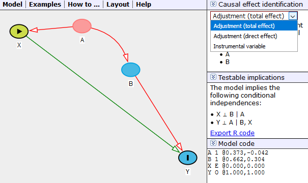

```{r setup, include=FALSE}
knitr::opts_chunk$set(echo = FALSE, warning=FALSE, message=FALSE)
library(tidyverse)
```

## Dagitty

- [Dagitty.net](http://www.dagitty.net) is a tool for building, drawing, and working with causal diagram
- It will be necessary for several homework and exam problems, and can also help you figure out how to identify effects
- You can also work with dagitty in R directly with the `dagitty` and `ggdag` packages, although this is more difficult and we won't be covering it here (although you can look into the code of the class slides to see how it's done)

## Getting Started

Go to [Dagitty.net](http://www.dagitty.net) and click on "Launch Dagitty Online in your Browser"


There you'll see the main dagitty screen with three areas. On the left it has style options; you can basically ignore this. In the middle you have the canvas to build your diagram on, and the menus. On the right it provides information about the causal diagram you've built.


## Building a Diagram

In "Model" select "New Model". It will ask you for your Exposure Variable (your `X`) and your Outcome Variable (your `Y`).

From there, you can add new variables by **double-clicking** on an empty part of the diagram.

You can add arrows from `A` to `B` by first double-clicking on `A` and then double-clicking on `B`. You can remove an existing arrow in the same way.

If you click-and-drag on an arrow, you can make it curvy, which may help avoid overlaps in complex diagrams. Similarly, you can click-and-drag the variables themselves.


## Diagram Building Hotkeys

See the "How to..." menu for these. In any case, to do something to a variable, hover your mouse over it and hit the appropriate key.

If you want to delete a variable, hit the "d" key. Or to rename it, hit "r".

To toggle whether a variable is the exposure variable, hit the "e" key. Similarly, "o" for the outcome variable.

To toggle whether a variable is *observed in your data* or not, hit the "u" key.

To toggle whether you've *controlled/adjusted* for a variable, hit "a".

## Saving/Exporting Your Diagram

You can save your work using Model -> Publish. You'll need to save the code/URL you get so you can Model -> Load it back in later.

You can also export your graph for viewing using Model -> Export. However, I've found these to be a little iffy, as dagitty tends to like to show the whole canvas and shrink everything really small. 

For saving your diagrams to turn in with homework, I recommend just taking a screenshot, cropped down to the area of your diagram. In Windows you can use the Snipping Tool (Windows Accessories -> Snipping Tool). On a Mac you can use Grab. Ideally, move your variables a little closer together so the image isn't huge before you take your screenshot.

## Using the Dagitty Diagnostics

The right bar of the screen contains lots of information about your diagram.



At the top you'll see that it gives you the Minimal Adjustment Sets. Given the exposure variable you've set, and the outcome variable, it will tell you what you could control for to close all back doors. Here, you can identify `X -> Y` by controlling for `A` OR by controlling for `B` (`A` and `B` together would also work, but these are *minimal* adjustment sets - no unnecessary controls).

You can also set it to look for instrumental variables, or to look for the "direct effect". We haven't talked about the direct effect in class, but it's basically looking *only* for `X -> Y`, and not counting for other front-door paths like `X -> C -> Y` (not pictured). You won't need to worry about this one for class.

Note that this is all based on the diagram you've drawn. It will also pay attention to the variables you've set to be Unobserved with the "u" key (it won't try to control for them) or Controlled/Adjusted with the "a" key (it will assume you're already controlling for them and see what other controls are necessary).

The diagram itself also has information. Any lines that are **red** represent arrows that are a part of an open back door. Lines that are **green** are on a front door path. And lines that are **black** are neither.

In the second panel on the right you can see the testable implications of the model. This shows you some relationships that *should not* be there if your model is right. Here, that upside-down T means "not related to" and the | means "controlling for". So, controlling for `A`, `X` and `B` should be unrelated. And controlling for both `B` and `X`, `A` and `Y` should be unrelated. You could test these yourself in data, and if you found they were related, you'd know the model was wrong.

